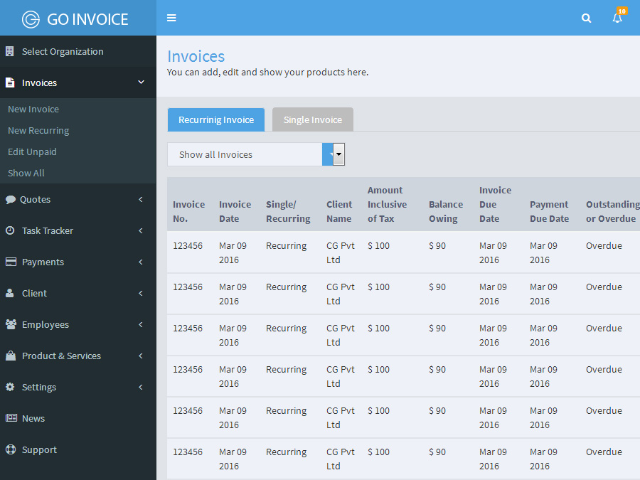

<!DOCTYPE html>
<html lang="en">
  <head>
    <meta charset="utf-8">
    <meta http-equiv="X-UA-Compatible" content="IE=edge">
    <meta name="viewport" content="width=device-width, initial-scale=1">
    <!-- The above 3 meta tags *must* come first in the head; any other head content must come *after* these tags -->
    <title>Websites and Webpanel Portfolio - Deepesh Fagna</title>

    <!-- Bootstrap -->
    <link href="css/bootstrap.css" rel="stylesheet">
    <link href="https://fonts.googleapis.com/css?family=PT+Sans:400,700" rel="stylesheet"> 
	
    <!-- HTML5 shim and Respond.js for IE8 support of HTML5 elements and media queries -->
    <!-- WARNING: Respond.js doesn't work if you view the page via file:// -->
    <!--[if lt IE 9]>
      
      
    <![endif]-->
  </head>
  <body style="font-size:16px;font-family: 'PT Sans', sans-serif;">
  <section style="background:#2f87ea;text-align:center;color:#fff;padding-bottom:10px;">
    

      

        

            <h3>Web design Portfolio</h3>
        

      

    

  </section>
  <section style="padding:20px 0">
    

        

            

                
Below are some links of Websites and Webpanels designed by our team. Please check them. Thanks! 

            

            

                

                    

                        <ul class="nav nav-tabs ">
                            <li class="active">
                                <a href="#tab_default_1" data-toggle="tab">Websites</a>
                            </li>
                            <li>
                                <a href="#tab_default_2" data-toggle="tab">Webpanels</a>
                            </li>
                        </ul>
                        

                            

                                

                                    

                                        

                                            
                                        

                                    

                                    

                                        

                                            
                                        

                                    

                                    

                                        

                                            
                                        

                                    

                                    

                                        

                                            
                                        

                                    

                                    

                                        

                                            
                                        

                                    

                                    

                                        

                                            
                                        

                                    

                                

                            

                            

                                

                                    

                                        

                                            
                                        

                                    

                                    

                                        

                                            
                                        

                                    

                                    

                                        

                                            
                                        

                                    

                                

                            

                        

                    

                

            

        

    

  </section>      
    <!-- jQuery (necessary for Bootstrap's JavaScript plugins) -->
    
    <!-- Include all compiled plugins (below), or include individual files as needed -->
    
  </body>
</html>
